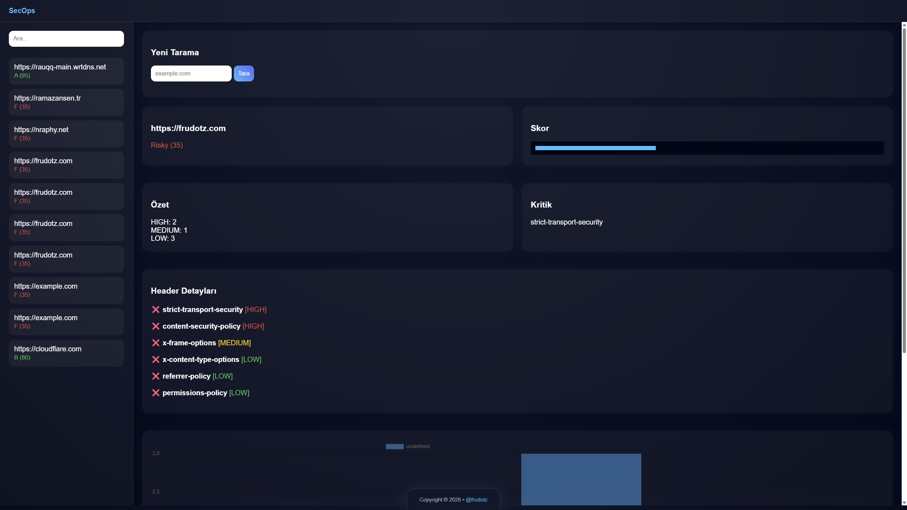

# HTTP Header Analyzer (SecOps Engine)

Modern web uygulamalarının güvenlik seviyesini hızlı ve anlaşılır şekilde analiz etmek için geliştirilmiş, CLI ve Web GUI destekli bir HTTP header analiz aracıdır.

Bu proje, gerçek dünya kullanım senaryolarını hedefleyen, performanslı ve modüler bir SecOps çözümü olarak tasarlanmıştır.


---

|  | Sızma Testi Proje Ödevi |
|---|---|
| **Öğrenci Adı** | Hamza Arda Karabacak |
| **Öğrenci No.** | 2520191010 |
| **Öğretim Gör. (Danışman)** | Keyvan Arasteh Abbasabad |
| **Ders Kodu & Adı** | BGT006 Sızma Testi |

---

## 📚 İçindekiler

- [🚀 Özellikler](#-özellikler)
- [🌐 Web GUI](#-web-gui)
- [🧠 Mimari Yaklaşım](#-mimari-yaklaşım)
- [⚙️ Kullanım](#️-kullanım)
  - [CLI](#cli)
  - [Batch Scan](#batch-scan)
  - [Web GUI](#web-gui)
- [🧪 Testing](#-testing)
- [🔒 Code Quality & Dev Workflow](#-code-quality--dev-workflow)
- [⚠️ Error Handling](#️-error-handling)
- [📁 Çıktılar](#-çıktılar)
- [📸 Dashboard Preview](#-dashboard-preview)
- [⚠️ Limitations](#️-limitations)
- [🧾 Versiyon](#-versiyon)
- [📌 Not](#-not)

---

## 🚀 Özellikler

* HTTP security header analizi
* Severity sistemi (HIGH / MEDIUM / LOW)
* Risk açıklamaları ve güvenlik yorumları
* Header value analizi:

  * HSTS (max-age kontrolü)
  * CSP (unsafe-inline kontrolü)
  * X-Frame-Options doğrulama
  * Referrer-Policy kontrolü
* Skor ve grade hesaplama (A–F)
* JSON rapor çıktısı (timestamp destekli)
* Batch scan desteği (.txt ile çoklu hedef)
* Renkli CLI çıktısı
* Web GUI (dashboard)

---

## 🌐 Web GUI

Kullanıcı dostu dashboard ile analiz sonuçlarını görselleştirir:

* Sidebar ile rapor yönetimi
* Arama (URL bazlı)
* Otomatik rapor seçimi
* Detaylı header analizi
* Risk dağılım grafiği (Chart.js)
* Critical issue gösterimi
* Görsel skor barı
* Responsive tasarım (mobil uyumlu)

---

## 🧠 Mimari Yaklaşım

Proje 3 ana katmandan oluşur:

* **CLI Layer** → kullanıcı etkileşimi ve batch işlemler
* **Analyzer Engine** → HTTP istekleri ve güvenlik analizi
* **Web Layer (Axum)** → REST API + GUI entegrasyonu

Bu yapı sayesinde sistem modüler, genişletilebilir ve sürdürülebilir hale getirilmiştir.

---

## ⚙️ Kullanım

### CLI

```bash
cargo run -- headers https://example.com
```

### Batch Scan

```bash
cargo run -- headers targets.txt
```

### Web GUI

```bash
cargo run -- web
```

Tarayıcı:
http://127.0.0.1:3000

---

## 🧪 Testing

```bash
cargo test
```

Ek olarak proje, gerçek dünya senaryolarını simüle eden async testler içerir.

---

## 🔒 Code Quality & Dev Workflow

* `cargo fmt` ile standart formatlama
* `cargo clippy` (strict mode) ile lint kontrolü
* Multi-platform CI pipeline (Ubuntu, Windows, Kali)
* `Justfile` ile standart geliştirme komutları:

  * `just build`
  * `just test`
  * `just lint`
  * `just ci`

---

## ⚠️ Error Handling

* Geçersiz URL kontrolü
* Timeout yönetimi
* Backend tarafında `Result<T>` kullanımı
* Web GUI kullanıcı geri bildirimleri

---

## 📁 Çıktılar

JSON raporlar:

```
assets/reports/
```

---

## 📸 Dashboard Preview



---

## ⚠️ Limitations

* Sadece HTTP header analizi yapar
* Aktif exploitation veya penetration test içermez
* Hedef sistem erişilebilir olmalıdır

---

## 🧾 Versiyon

v0.5.0

---

## 📌 Not

Bu proje, SecOps ve güvenlik analiz araçlarının temel prensiplerini göstermek amacıyla geliştirilmiştir. Gerçek sistemlerde daha kapsamlı güvenlik testleri önerilir.
